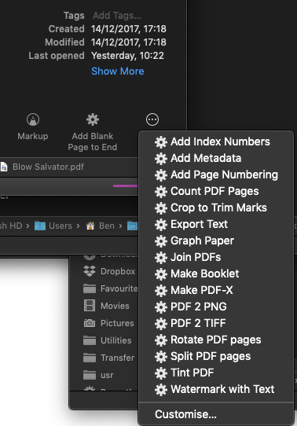
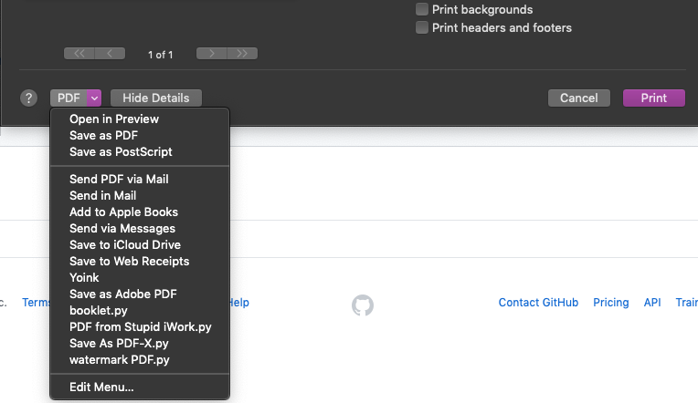

# PDFsuite
### Python scripts for MacOS (OS X) that create, manipulate, and query PDF files.  
### Everything you could possibly want to do to a PDF is just a click away!

* Combine and split PDFs
* Convert PDFs to images and images to PDFs
* Booklet imposition, crop and trim PDFs
* Rotate PDFs
* Add page numbers, watermarks, tints or other text and graphics to PDFs
* Apply Quartz filters to PDFs
* Read and write metadata (e.g. Author, Creator, Table of Contents) to PDFs

This is all done by accessing the Core Graphics Quartz APIs inside MacOS. No additional libraries or dependencies are required. They should therefore run on any Mac using 10.6 Snow Leopard or higher!

Most of these scripts are designed to be used as Quick Actions _(aka Services);_ PDF Services _(in the PDF button of the Print dialog);_ or as Terminal commands, with filenames as arguments.

### Quick Actions

<!--  -->

<!--  -->
Most of the scripts are designed  be used in the Run Shell Script action of Apple's Automator app, which provides an easy interface for use. Once an Automator service is installed in the user's Library/Services folder, it will be available in the Finder's Quick Actions menu (or right-click context menu) when PDF files are selected. Quick Actions/Services can be modified in Apple's Automator utility. 
NB: Quick Actions were introduced with MacOS 10.14 Mojave. Earlier OS versions will need to create their own Automator workflows from the bare python scripts. Instructions are available.

### PDF Services
Some are designed as **PDF Services**. PDF Services should be installed in the {user}/Library/PDF Services folder (or the top-level /Library/PDF Services folder). They will then be available in the PDF button of the print menu. _See the ReadMe in the subfolder for installation instructions._
<!--  -->

<!--  -->

### Terminal shell scripts
The bare scripts can also be run directly in a Unix shell (Terminal), taking one or more PDF files as their argument. They are found here in the **Automator_Scripts** folder. _(Drag the script file onto a Terminal window; then drag the PDF files you want to the same window; then press Enter!)_ 
A few scripts take more complex arguments and so will only work as Unix **shell scripts**. They may need further work for other purposes.

The Suite also includes some **Quartz Filters**, which can apply various transformations to PDF files, such as PDF/X-3 compliance or reduced file size.

Apple already includes Automator actions that provide some (but not all) of these functions -- however, PDFSuite python scripts are faster, better and more easily configured for different uses than Apple's own actions! They also serve as useful algorithmic examples of how to use Apple's APIs, which may benefit programmers working in any language.

## Quick Actions
***Add Blank Page (addpage.py)***  
Adds a blank page to the end of a PDF file.

***Add Index Numbers (indexnumbers.py)***  
Adds the text "n of x" to the first page of all selected PDF documents, where x is the total number of PDFs, and n is a sequential index. New PDFs are saved to a folder, named "Indexed".

***Add Page Number (pagenumber.py)***  
Adds a folio number to facing pages of PDF files supplied as arguments. Users can set the offset position from the outer top corner, font, size.

***Combine images to one PDF (imagestopdf.py)***  
This script is several seconds faster than the python script in Apple's own Automator action. It also adds a Table of Contents entry for each component file.

***Count pages in PDF (countpages.py)***  
Counts the cumulative number of pages in all the PDF files passed to it.

***Export pages as images (pdf2tiff.py)***  
Two actions are provided: one to produce TIFFs, and one to produce PNGs, both at 300dpi RGB. Options in the script allow for JPEG filetype, and changes to resolution, transparency and other parameters. 

***Join PDF files into one file (joinpdfs.py)*** 
Combine all PDF files supplied as arguments into one file, called _Combined.pdf_. 

***Rotate all pages in PDF (rotate.py)***  
Rotate all the pages of any PDF files passed as arguments by 90º into a new file suffixed "+90". 

***Split PDF into separate files (splitPDF.py)***  
Creates separate PDFs for each page in an existing PDF. A new folder is created for the paged documents of each original PDF.

***Watermark all pages of PDF (watermark.py)***  
Adds the word "SAMPLE" in 150pt Helvetica-Bold, at 45˚ angle, with 50% opacity, to every page of PDFs passed to it. These settings can easily be altered to other font, angle and opacity.

## PDF Services
***Booklet Imposition (booklet.py)***  
Designed to work from the PDF button of the print menu, this script creates booklet spread sheets, then brings up a Save dialog.

***PDF From  iWork (Save_PDF_from_iWork.py)***
Apple's iWork apps (Pages, Numbers, KeyNote) will append the .pdf file extension onto the existing file extension (e.g. Myfile.pages.pdf) when saving PDFs through the Print dialog. This script removes the iWork file extension and prompts to save the correctly named PDF. This will work for other apps that also leave their file extension on.

***Save As PDF-X PDF Service (Save As PDF-X.py)***  
This replaces the PDF Service that Apple removed from MacOS in Snow Leopard, which saved the PDF after applying a filter that makes the PDF conform to PDF/X-3 spec. Apple's built-in PDF-X filter is quite poor, so you may want to use a better one. An improved PDF/X-3 filter is included in this suite, and is used by the script, if installed.

***Watermark PDF (watermark PDF.py)***
This script merges the printed output with a PDF template file of your choosing. Ideal for creating 'letterhead' PDFs that can be applied to the printed output of any application.

## Shell scripts
***Apply Quartz Filter (quartzfilter.py)***  
This replaces Apple's own _quartzfilter_ command, which was removed from OS X (in Lion?). It takes three arguments: the input file, the path to the quartz filter, and an output filename. It could be easily modified along the lines of the other scripts, to apply one fixed filter to all files given as arguments.

***Creator (creator.py)***  
Changes the "Creator" metadata to the value supplied. Other metadata keys are provided, allowing the script to be easily modified for other metadata values. If no output file is set, it will overwrite the input file.  
creator.py -c CreatorName -i inputfile [-o outputfile]

***Get Info (getInfo.py)***  
Outputs all the available PDF metadata for a file: Author, Creator, etc, Number of Pages, Version number, flags for encryption and security.

***Get PDF from Clipboard (getPDFclip.py)***  
Saves PDF data on the MacOS Clipboard to a file, adding pages for each save.

***List Quartz Filters (listFilters.py)***  
Lists all Quartz Filters installed on the system.

***Page Layout (pagelayout.py)***  
Provides simple functions to easily draw rectangles, circles, lines, and text on a PDF page, with colours and transparency. 

## Notes

Please read the Notes.md file for details of future plans, limitations and known issues.

## LICENCE:
These scripts were not possible without taking inspiration from other code examples, particularly the [Apple open source python scripts](https://opensource.apple.com/source/pyobjc/); nor without help and advice from a range of people, such as Jeff Laing, user Hiroto on Apple Support Community and the users of [StackOverFlow](http://stackoverflow.com). Also Cocoa/ObjC code in other languages. The scripts are free to be used and adapted in any way, though I ask that you retain the acknowledgements within. I welcome help in improving them.

Ben Byram-Wigfield
